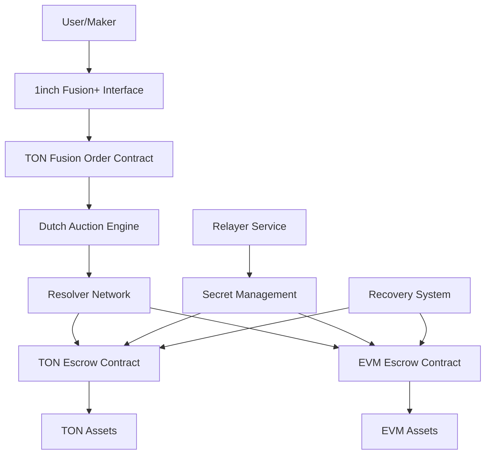

# 1inch Fusion+ TON Implementation Guide

## Executive Summary

This document provides a comprehensive guide for extending the 1inch Fusion+ intent-based atomic cross-chain swap protocol to support The Open Network (TON) blockchain. The implementation will enable decentralized, trustless cross-chain swaps between TON and other supported chains (Ethereum, BSC, Polygon, etc.) while maintaining the security, efficiency, and user experience benefits of the original Fusion+ protocol.

## Table of Contents

1. [Protocol Overview](#protocol-overview)
2. [TON Blockchain Analysis](#ton-blockchain-analysis)
3. [Architecture Design](#architecture-design)
4. [Implementation Components](#implementation-components)
5. [Development Roadmap](#development-roadmap)
6. [Security Considerations](#security-considerations)
7. [Testing Strategy](#testing-strategy)
8. [Deployment Guide](#deployment-guide)

---

## Protocol Overview

### 1inch Fusion+ Core Concepts

**Intent-Based Architecture**: Users express trading intent, and resolvers (professional market makers) compete to fulfill orders through Dutch auctions.

**Key Components**:

- **Makers**: Users initiating cross-chain swaps
- **Resolvers**: KYC'd entities executing swaps and providing liquidity
- **Dutch Auctions**: Competitive pricing mechanism ensuring best rates
- **Escrow Contracts**: Secure asset holding during swap process
- **Hashlocks & Timelocks**: Cryptographic security mechanisms

**Four-Phase Process**:

1. **Announcement Phase**: Maker signs intent, Dutch auction begins
2. **Deposit Phase**: Resolver deposits assets on both chains
3. **Withdrawal Phase**: Secret revealed, assets transferred
4. **Recovery Phase**: Timeout handling and asset recovery

### Key Advantages Over Traditional Atomic Swaps

- **Simplified UX**: Makers only sign once, resolvers handle everything
- **Competitive Pricing**: Dutch auctions ensure optimal rates
- **Professional Execution**: Resolvers provide reliability and speed
- **Partial Fills**: Support for partial order execution
- **Gas Optimization**: Dynamic price adjustments for gas costs

---

## TON Blockchain Analysis

### TON Smart Contract Capabilities

**Programming Languages**:

- **FunC**: Primary smart contract language (functional, optimized for TVM)
- **Tact**: High-level language (TypeScript-like syntax)
- **Fift**: Low-level assembler language

**Key Features Supporting Cross-Chain Swaps**:

- ✅ **Hashlocks**: SHA-256 hashing available
- ✅ **Timelocks**: Block-based and timestamp-based locking
- ✅ **Multi-sig**: Native multi-signature support
- ✅ **Message System**: Internal messages for complex interactions
- ✅ **Storage**: Persistent data storage
- ✅ **Gas Model**: Predictable transaction costs

**TON Virtual Machine (TVM)**:

- Stack-based architecture
- 257-bit integers (accommodates crypto operations)
- Built-in cryptographic functions
- Deterministic execution

### Existing TON Cross-Chain Infrastructure

**Established Patterns**:

- TON-ETH Bridge (Official): Decentralized oracle-based bridge
- Atomic Swap Implementations: Multiple HTLC-based solutions
- DEX Implementations: Several AMM and order-book exchanges

**Reference Implementations**:

- [broxus/ton-atomic-swap](https://github.com/broxus/ton-atomic-swap): Production-ready HTLC
- [tonswap/tonswap-contracts](https://github.com/tonswap/tonswap-contracts): AMM implementation
- Official TON bridge contracts: Cross-chain infrastructure

---

## Architecture Design

### High-Level Architecture



### Component Architecture

#### 1. TON-Side Components

**TON Fusion Order Contract** (`fusion_order.fc`):

- Order creation and validation
- Dutch auction parameter management
- Resolver selection logic
- Order status tracking

**TON Escrow Contract** (`ton_escrow.fc`):

- Asset locking with hashlock/timelock
- Multi-signature support for resolvers
- Withdrawal and refund mechanisms
- Safety deposit handling

**TON Resolver Registry** (`resolver_registry.fc`):

- KYC'd resolver management
- Stake and reputation tracking
- Resolver selection algorithms

#### 2. Cross-Chain Components

**Cross-Chain Message Relayer**:

- TON ↔ EVM communication
- Secret sharing and validation
- Order synchronization
- Recovery coordination

**Multi-Chain Resolver Network**:

- Professional market makers
- Cross-chain liquidity provision
- Risk management systems

#### 3. Off-Chain Infrastructure

**Fusion+ API Extensions**:

- TON blockchain integration
- Order management for TON pairs
- Price discovery and routing
- Historical data and analytics

---

## Implementation Components

### 1. Smart Contracts

#### TON Fusion Order Contract

```func
;; fusion_order.fc - Core order management contract

#include "imports/stdlib.fc";

;; Storage structure
;; order_id: uint256
;; maker: MsgAddress
;; from_token: MsgAddress
;; to_token: MsgAddress
;; amount: Coins
;; target_chain: uint32
;; auction_start_amount: Coins
;; auction_end_amount: Coins
;; auction_duration: uint32
;; secret_hash: uint256
;; status: uint8
;; resolver: MsgAddress
;; created_at: uint32

const int ORDER_STATUS_CREATED = 0;
const int ORDER_STATUS_ACCEPTED = 1;
const int ORDER_STATUS_COMPLETED = 2;
const int ORDER_STATUS_CANCELLED = 3;

;; Main contract functions
() recv_internal(int my_balance, int msg_value, cell in_msg_full, slice in_msg_body) impure {
    ;; Handle internal messages
    ;; - create_order
    ;; - accept_order (resolver)
    ;; - complete_order
    ;; - cancel_order
}

() create_fusion_order(
    slice maker,
    slice from_token,
    slice to_token,
    int amount,
    int target_chain,
    int auction_start_amount,
    int auction_end_amount,
    int auction_duration,
    int secret_hash
) impure {
    ;; Create new fusion order with Dutch auction parameters
}

() accept_order_by_resolver(slice resolver, int order_id) impure {
    ;; Resolver accepts order at current auction price
}
```

#### TON Escrow Contract

```func
;; ton_escrow.fc - Secure asset escrow with HTLC

#include "imports/stdlib.fc";

const int ESCROW_STATUS_LOCKED = 1;
const int ESCROW_STATUS_REVEALED = 2;
const int ESCROW_STATUS_WITHDRAWN = 3;
const int ESCROW_STATUS_REFUNDED = 4;

;; Storage: escrow_id, amount, hashlock, timelock, recipient, refund_address, status

() recv_internal(int my_balance, int msg_value, cell in_msg_full, slice in_msg_body) impure {
    slice cs = in_msg_full.begin_parse();
    int flags = cs~load_uint(4);
    slice sender_address = cs~load_msg_addr();

    int op = in_msg_body~load_uint(32);

    if (op == 1) { ;; withdraw
        slice secret = in_msg_body~load_ref().begin_parse();
        withdraw_with_secret(sender_address, secret);
    } elseif (op == 2) { ;; refund
        refund_after_timeout(sender_address);
    }
}

() withdraw_with_secret(slice recipient, slice secret) impure {
    ;; Verify secret hash matches
    ;; Transfer assets to recipient
    ;; Update status
}

() refund_after_timeout(slice refund_address) impure {
    ;; Check timeout has passed
    ;; Refund to original depositor
}
```

### 2. Resolver Integration

#### Resolver Requirements for TON

```typescript
interface TONResolver {
  // Resolver identification
  resolverId: string;
  tonAddress: string;
  evmAddresses: Record<number, string>; // chainId -> address

  // Capabilities
  supportedTokens: {
    ton: string[];
    evm: Record<number, string[]>;
  };

  // Risk management
  maxOrderSize: bigint;
  stakeAmount: bigint;
  reputation: number;

  // Implementation
  acceptOrder(order: FusionOrder): Promise<boolean>;
  executeSwap(order: FusionOrder): Promise<SwapResult>;
  handleRecovery(order: FusionOrder): Promise<void>;
}
```

### 3. API Integration

#### TON Fusion API Extensions

```typescript
// Extend existing 1inch Fusion SDK
class TONFusionExtension {
  async createTONOrder(params: TONOrderParams): Promise<TONFusionOrder> {
    // Create order on TON blockchain
    // Register with resolver network
    // Start Dutch auction
  }

  async getQuote(
    fromToken: string,
    toToken: string,
    amount: bigint
  ): Promise<Quote> {
    // Get cross-chain quotes including TON pairs
    // Factor in bridge costs and risks
    // Return competitive pricing
  }

  async trackOrder(orderId: string): Promise<OrderStatus> {
    // Monitor order across multiple chains
    // Provide real-time updates
    // Handle error conditions
  }
}
```

### 4. Secret Management

#### Merkle Tree Secrets for Partial Fills

```typescript
class TONSecretManager {
  generateSecretTree(numParts: number): SecretTree {
    // Generate N+1 secrets for N parts
    // Create Merkle tree structure
    // Return root hash and proofs
  }

  revealSecret(partIndex: number, tree: SecretTree): string {
    // Reveal appropriate secret for partial fill
    // Validate against tree structure
    // Update order state
  }
}
```

---

## Development Roadmap

### Phase 1: Foundation (Months 1-2)

- [ ] TON development environment setup
- [ ] Core smart contract implementation (FunC)
- [ ] Local testing framework
- [ ] Basic HTLC functionality

**Deliverables**:

- TON Escrow Contract (v1)
- TON Order Contract (v1)
- Local test suite
- Development documentation

### Phase 2: Core Protocol (Months 3-4)

- [ ] Dutch auction implementation
- [ ] Resolver registry system
- [ ] Cross-chain message relaying
- [ ] Secret management system

**Deliverables**:

- Complete smart contract suite
- Resolver integration framework
- Cross-chain communication layer
- Security audit preparation

### Phase 3: Integration (Months 5-6)

- [ ] 1inch API integration
- [ ] Resolver onboarding system
- [ ] Frontend integration
- [ ] Testnet deployment

**Deliverables**:

- Production-ready contracts
- Resolver dashboard
- User interface
- Testnet launch

### Phase 4: Production (Months 7-8)

- [ ] Security audits
- [ ] Mainnet deployment
- [ ] Resolver network launch
- [ ] Monitoring and analytics

**Deliverables**:

- Audited smart contracts
- Mainnet deployment
- Production monitoring
- User documentation

---

## Security Considerations

### Smart Contract Security

**TON-Specific Risks**:

- **Gas Limits**: TON has different gas mechanics than EVM
- **Message System**: Complex internal message flows
- **Integer Overflow**: 257-bit integers require careful handling
- **Upgrade Mechanisms**: Consider contract upgradeability

**Mitigation Strategies**:

- Comprehensive testing with ton-contract-executor
- Formal verification where possible
- Multiple security audits
- Gradual rollout with caps

### Cross-Chain Security

**Bridge Security**:

- Use established TON bridge infrastructure
- Implement time delays for large transfers
- Multi-signature requirements for critical operations

**Resolver Trust Model**:

- KYC/AML compliance for all resolvers
- Stake-based security model
- Reputation and slashing mechanisms
- Geographic distribution requirements

### Secret Management

**Secret Sharing**:

- Use secure multi-party computation where possible
- Implement secret recovery mechanisms
- Time-based secret rotation
- Secure communication channels

---

## Testing Strategy

### Unit Testing

```typescript
// ton-fusion.test.ts
describe("TON Fusion Protocol", () => {
  test("should create fusion order correctly", async () => {
    // Test order creation
    // Verify auction parameters
    // Check state transitions
  });

  test("should handle partial fills", async () => {
    // Test Merkle tree secrets
    // Verify partial execution
    // Check remaining order state
  });

  test("should recover funds on timeout", async () => {
    // Test timeout scenarios
    // Verify refund mechanisms
    // Check resolver penalties
  });
});
```

### Integration Testing

```typescript
// cross-chain.test.ts
describe("Cross-Chain Integration", () => {
  test("should complete full swap cycle", async () => {
    // Create order on TON
    // Accept on Ethereum
    // Execute swap
    // Verify final balances
  });

  test("should handle resolver failures", async () => {
    // Simulate resolver going offline
    // Test backup resolver selection
    // Verify order completion
  });
});
```

### End-to-End Testing

**Test Scenarios**:

- Happy path: Successful cross-chain swap
- Timeout scenarios: Various failure modes
- Partial fills: Complex order execution
- Resolver competition: Multiple resolvers bidding
- Network failures: Cross-chain communication issues

---

## Deployment Guide

### Prerequisites

**Development Environment**:

```bash
# Install TON development tools
npm install -g ton-contract-executor
npm install -g @ton-community/func-js

# Clone implementation repository
git clone https://github.com/your-org/ton-fusion-plus
cd ton-fusion-plus

# Install dependencies
npm install
```

**Required Infrastructure**:

- TON node access (mainnet/testnet)
- 1inch API access
- Resolver infrastructure
- Monitoring systems

### Contract Deployment

```typescript
// deploy.ts
async function deployTONFusion() {
  // Deploy escrow contract
  const escrowContract = await deployContract("ton_escrow.fc", {
    // initialization parameters
  });

  // Deploy order contract
  const orderContract = await deployContract("fusion_order.fc", {
    escrowAddress: escrowContract.address,
    // other parameters
  });

  // Deploy resolver registry
  const registryContract = await deployContract("resolver_registry.fc", {
    // registry parameters
  });

  return {
    escrow: escrowContract,
    order: orderContract,
    registry: registryContract,
  };
}
```

### Configuration

```json
{
  "ton": {
    "network": "mainnet",
    "contracts": {
      "escrow": "EQD...",
      "order": "EQD...",
      "registry": "EQD..."
    }
  },
  "resolvers": {
    "minStake": "1000000000000",
    "maxOrderSize": "10000000000000",
    "timeoutDuration": 86400
  },
  "auction": {
    "defaultDuration": 600,
    "minPriceImpact": 0.001,
    "maxPriceImpact": 0.1
  }
}
```

### Monitoring

**Key Metrics**:

- Order completion rate
- Average execution time
- Resolver performance
- Cross-chain message latency
- User satisfaction scores

**Alerting**:

- Failed order execution
- Resolver unavailability
- Smart contract errors
- Unusual price movements
- Security incidents

---

## Conclusion

The extension of 1inch Fusion+ to TON blockchain represents a significant advancement in cross-chain DeFi infrastructure. By leveraging TON's unique capabilities and the proven Fusion+ architecture, this implementation will provide users with:

- **Seamless UX**: Simple one-click cross-chain swaps
- **Competitive Pricing**: Dutch auction optimization
- **Professional Execution**: Reliable resolver network
- **Enhanced Security**: Battle-tested cryptographic primitives
- **Scalable Infrastructure**: Built for mass adoption

The development timeline of 8 months provides adequate time for thorough implementation, testing, and security validation. The phased approach ensures progressive risk management while delivering value to users incrementally.

**Next Steps**:

1. Finalize technical specifications
2. Assemble development team
3. Begin Phase 1 implementation
4. Establish resolver partnerships
5. Prepare for security audits

This implementation will position 1inch as the premier cross-chain DEX aggregator with comprehensive TON support, opening new markets and use cases in the rapidly growing TON ecosystem.

---

## References

- [1inch Fusion+ Whitepaper](https://1inch.io/assets/1inch-fusion-plus.pdf)
- [TON Documentation](https://docs.ton.org/)
- [TON Smart Contract Examples](https://docs.ton.org/v3/documentation/smart-contracts/contracts-specs/examples)
- [Broxus Atomic Swap Implementation](https://github.com/broxus/ton-atomic-swap)
- [TON Bridge Architecture](https://docs.ton.org/v3/documentation/infra/crosschain/overview)
- [1inch Fusion SDK](https://github.com/1inch/fusion-sdk)

---

_This document is a living specification and will be updated as implementation progresses and requirements evolve._ g
