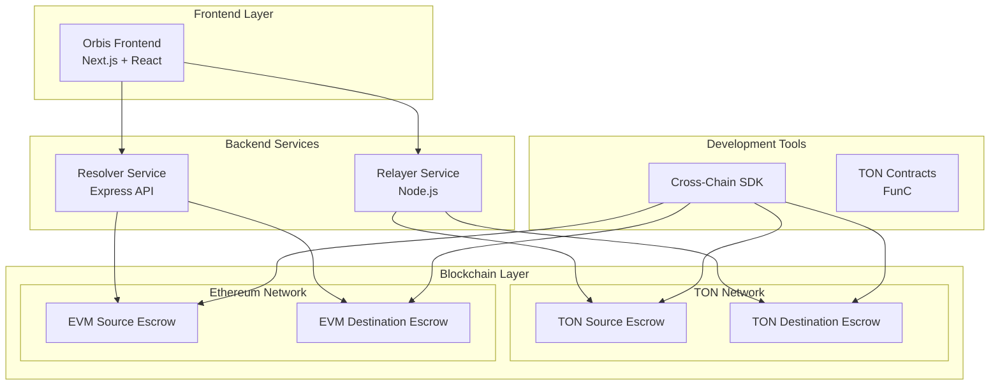
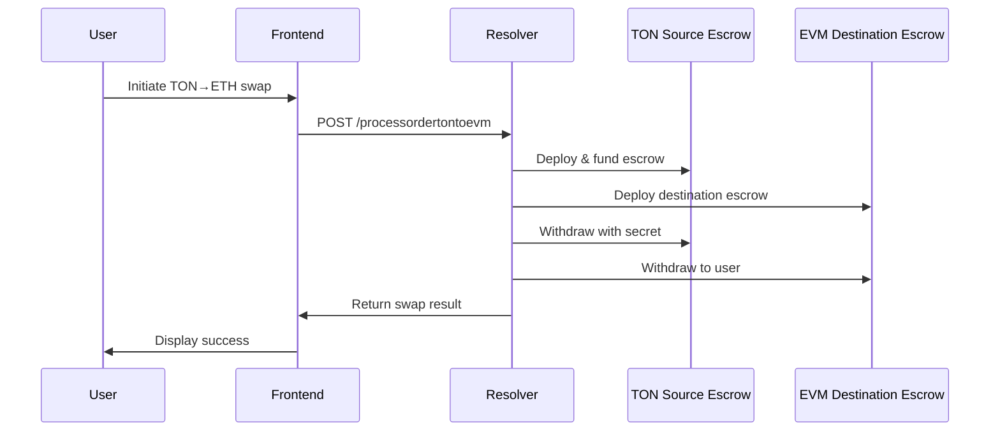
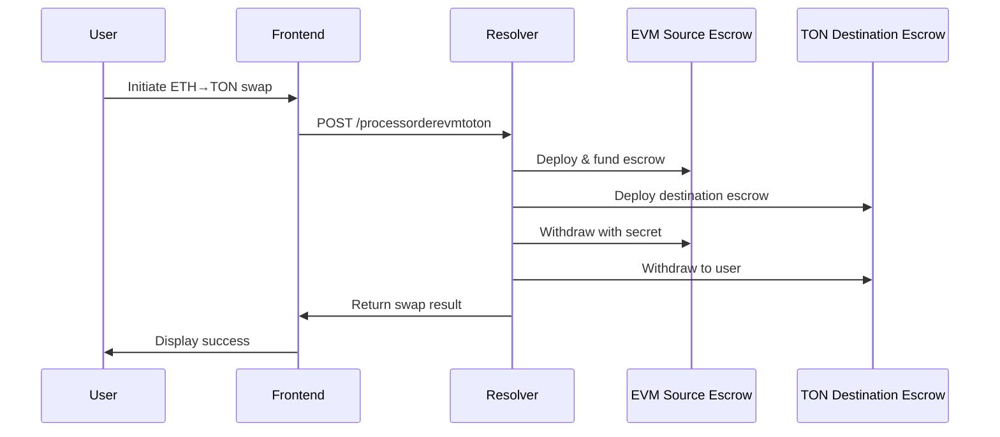

# Orbis - Cross-Chain Bridge Protocol

A decentralized cross-chain bridge protocol enabling seamless atomic swaps between TON and Ethereum networks using Hash Time Locked Contracts (HTLCs) and escrow mechanisms.

## 🌟 Features

- **Bidirectional Cross-Chain Swaps**: Support for both TON→ETH and ETH→TON swaps
- **Atomic Swaps**: Secure HTLC-based escrow contracts ensure atomic transactions
- **Multi-Component Architecture**: Separate frontend, relayer, resolver, and smart contracts
- **Modern UI**: Dark-themed, responsive frontend with glassmorphism effects
- **Multi-Wallet Support**: 
  - Ethereum: RainbowKit integration (MetaMask, WalletConnect, etc.)
  - TON: TON Connect SDK integration
- **Testnet Ready**: Configured for Sepolia (ETH) and TON Testnet

## 🏗️ Architecture Overview



## 🔄 Cross-Chain Swap Flow

### TON to ETH Swap Flow


### ETH to TON Swap Flow


## 📁 Project Structure

```
orbis/
├── orbis-frontend/           # Next.js frontend application
│   ├── src/
│   │   ├── components/       # React components
│   │   ├── utils/           # Utility functions & API clients
│   │   └── types/           # TypeScript type definitions
│   └── README.md
├── cross-chain-sdk-ton/     # TypeScript SDK for cross-chain operations
│   ├── src/
│   │   ├── api/            # API clients (Fusion, Quoter, Relayer)
│   │   ├── cross-chain-order/ # Order management
│   │   ├── escrow-factory/ # Escrow contract factories
│   │   └── sdk/            # Main SDK interface
│   └── README.md
├── resolver/                # Express.js API server & resolver service
│   ├── src/
│   │   ├── adapters/       # TON & EVM blockchain adapters
│   │   ├── demo/           # Demo scripts
│   │   └── server.ts       # Main API server
│   └── README.md
├── relayer/                # Relayer service for cross-chain operations
│   ├── src/
│   │   └── relayer.ts      # Main relayer logic
│   └── README.md
└── ton/                    # TON smart contracts (FunC)
    ├── contracts/          # Smart contract source code
    ├── scripts/            # Deployment & interaction scripts
    ├── wrappers/           # TypeScript contract wrappers
    └── README.md
```

## 🚀 Quick Start

### Prerequisites

- Node.js 18+ and npm/pnpm
- Git
- TON Wallet (for TON operations)
- Ethereum Wallet (for ETH operations)

### Complete Setup

1. **Clone the repository**
   ```bash
   git clone <repository-url>
   cd orbis
   ```

2. **Set up all components**
   ```bash
   # Install dependencies for all projects
   cd orbis-frontend && npm install && cd ..
   cd cross-chain-sdk-ton && pnpm install && cd ..
   cd resolver && npm install && cd ..
   cd relayer && npm install && cd ..
   cd ton && npm install && cd ..
   ```

3. **Configure environment variables**
   ```bash
   # Frontend
   cd orbis-frontend
   cp .env.local.example .env.local
   # Edit .env.local with your values
   
   # Resolver
   cd ../resolver
   cp env.example .env
   # Edit .env with your blockchain configurations
   ```

4. **Start all services**
   ```bash
   # Terminal 1: Start resolver
   cd resolver && npm run dev
   
   # Terminal 2: Start relayer (if needed)
   cd relayer && npm start
   
   # Terminal 3: Start frontend
   cd orbis-frontend && npm run dev
   ```

5. **Open your browser**
   Navigate to `http://localhost:3000`

## 🔧 Environment Variables

### Frontend (`orbis-frontend/.env.local`)
```env
NEXT_PUBLIC_WALLETCONNECT_PROJECT_ID=your_walletconnect_project_id
NEXT_PUBLIC_TON_MANIFEST_URL=https://your-domain.com/tonconnect-manifest.json
NEXT_PUBLIC_RELAYER_URL=http://localhost:3001
```

### Resolver (`resolver/.env`)
```env
# TON Configuration
TON_NETWORK=testnet
TON_ENDPOINT=https://testnet.toncenter.com/api/v2/jsonRPC
TON_API_KEY=your_ton_api_key
TON_MNEMONIC=your_ton_wallet_mnemonic

# EVM Configuration
EVM_RPC_URL=https://sepolia.infura.io/v3/your_infura_key
EVM_PRIVATE_KEY=your_ethereum_private_key
EVM_ESCROW_FACTORY=0x_your_escrow_factory_address
```

## 🌐 Supported Networks

| Network | Type | RPC Endpoint | Explorer |
|---------|------|-------------|----------|
| TON Testnet | Testnet | https://testnet.toncenter.com | https://testnet.tonscan.org |
| Ethereum Sepolia | Testnet | Infura/Alchemy | https://sepolia.etherscan.io |

## 🛠️ Development

### Frontend Development
```bash
cd orbis-frontend
npm run dev          # Start development server
npm run build        # Build for production
npm run lint         # Run ESLint
npm run typecheck    # TypeScript type checking
```

### Smart Contract Development
```bash
cd ton
npm run build        # Compile contracts
npm test            # Run tests
npm run deploy       # Deploy contracts
```

### SDK Development
```bash
cd cross-chain-sdk-ton
pnpm build          # Build SDK
pnpm test           # Run tests
```

### Resolver Development
```bash
cd resolver
npm run dev         # Start with nodemon
npm run build       # Build TypeScript
npm start           # Start production server
```

## 🔐 Security Features

- **HTLC Security**: Hash Time Locked Contracts prevent fund loss
- **Atomic Swaps**: Either both sides complete or both revert
- **Timelock Protection**: Automatic refunds after timeout periods
- **Secret Management**: Secure secret generation and revelation
- **Multi-Signature**: Resolver acts as trusted intermediary
- **Testnet Only**: Current configuration prevents mainnet risks

## 📊 API Endpoints

### Resolver Service (Port 3001)

| Method | Endpoint | Description |
|--------|----------|-------------|
| GET | `/health` | Health check |
| POST | `/processordertontoevm` | Create TON→ETH swap |
| POST | `/processorderevmtoton` | Create ETH→TON swap |

## 🧪 Testing

Each component includes comprehensive tests:

```bash
# Test all components
cd cross-chain-sdk-ton && pnpm test
cd ton && npm test
cd resolver && npm test
```

## 🤝 Contributing

1. Fork the repository
2. Create a feature branch (`git checkout -b feature/amazing-feature`)
3. Make your changes
4. Add tests if applicable
5. Commit your changes (`git commit -m 'Add amazing feature'`)
6. Push to the branch (`git push origin feature/amazing-feature`)
7. Open a Pull Request

## 📄 License

This project is licensed under the MIT License - see individual component READMEs for details.

---

**⚠️ Testnet Only**: This application is currently configured for testnet use only. No real funds are at risk.

**🔗 Links**
- [TON Documentation](https://docs.ton.org/)
- [Ethereum Documentation](https://ethereum.org/developers/)
- [Cross-Chain Bridge Security](https://blog.li.fi/what-are-bridges-in-crypto-reviewing-the-risks-b6e7de47c4a8) 