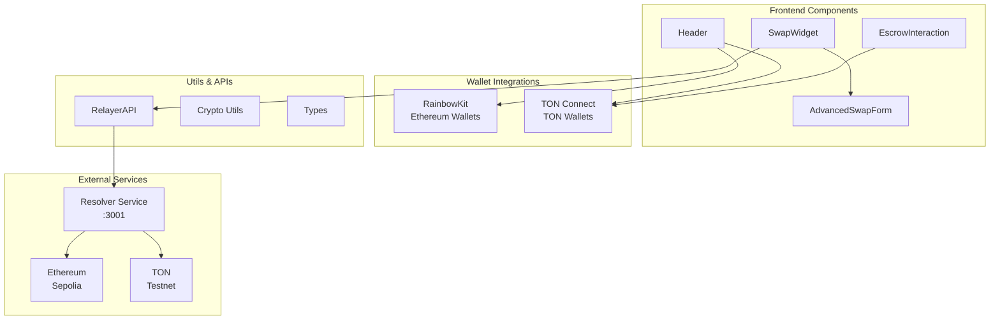
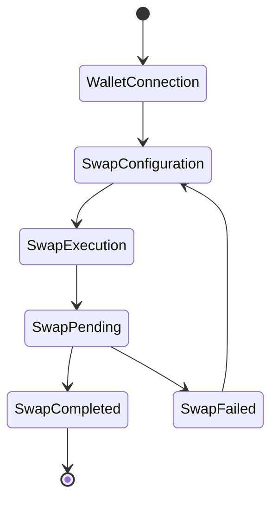

# Orbis Frontend

A modern, responsive Next.js frontend for the Orbis cross-chain bridge protocol. Built with React 19, TypeScript, and Tailwind CSS, featuring glassmorphism design and multi-wallet support.

## 🌟 Features

- **Modern UI/UX**: Dark theme with glassmorphism effects and smooth animations
- **Multi-Wallet Support**: 
  - Ethereum: RainbowKit integration (MetaMask, WalletConnect, Coinbase Wallet, etc.)
  - TON: TON Connect SDK integration
- **Bidirectional Swaps**: Support for both TON→ETH and ETH→TON swaps
- **Real-time Updates**: Live swap status and transaction monitoring
- **Responsive Design**: Mobile-first approach with desktop optimization
- **Type Safety**: Full TypeScript implementation with strict type checking

## 🏗️ Architecture



## 🚀 Quick Start

### Prerequisites

- Node.js 18+ and npm
- Git
- Ethereum wallet (MetaMask recommended)
- TON wallet (Tonkeeper recommended)

### Installation

1. **Clone and navigate**
   ```bash
   git clone <repository-url>
   cd orbis/orbis-frontend
   ```

2. **Install dependencies**
   ```bash
   npm install
   ```

3. **Set up environment variables**
   ```bash
   cp .env.local.example .env.local
   ```
   
   Edit `.env.local`:
   ```env
   NEXT_PUBLIC_WALLETCONNECT_PROJECT_ID=your_walletconnect_project_id
   NEXT_PUBLIC_TON_MANIFEST_URL=https://your-domain.com/tonconnect-manifest.json
   NEXT_PUBLIC_RELAYER_URL=http://localhost:3001
   ```

4. **Start development server**
   ```bash
   npm run dev
   ```

5. **Open browser**
   Navigate to `http://localhost:3000`

## 📁 Project Structure

```
src/
├── app/                    # Next.js 13+ app directory
│   ├── layout.tsx         # Root layout with providers
│   └── page.tsx           # Home page
├── components/            # React components
│   ├── swap-widget.tsx    # Main swap interface
│   ├── advanced-swap-form.tsx # Advanced configuration
│   ├── escrow-interaction.tsx # Direct contract interaction
│   ├── header.tsx         # Navigation header
│   └── providers.tsx      # Context providers wrapper
├── lib/                   # Library configurations
│   └── wagmi.ts          # Wagmi/RainbowKit config
├── styles/               # Styling
│   └── globals.css       # Global styles and Tailwind
├── types/                # TypeScript definitions
│   └── relayer.ts        # API and swap types
└── utils/                # Utility functions
    ├── crypto.ts         # Cryptographic utilities
    └── relayer-api.ts    # API client for resolver service
```

## 🎨 Design System

### Color Palette
- **Primary**: Purple gradients (`from-purple-600 to-purple-800`)
- **Secondary**: Cyan accents (`from-cyan-400 to-cyan-600`)
- **Background**: Dark grays (`bg-gray-900`, `bg-gray-800`)
- **Glass**: Semi-transparent overlays with backdrop blur

### Typography
- **Font**: Geist Sans (primary), Geist Mono (code)
- **Hierarchy**: Clear heading levels with consistent spacing
- **Responsive**: Fluid typography scaling

### Components
- **Glass Cards**: Rounded corners with backdrop blur
- **Gradient Buttons**: Interactive hover states
- **Form Inputs**: Consistent styling with validation states
- **Loading States**: Smooth animations and skeleton screens

## 🔧 Configuration

### Environment Variables

| Variable | Description | Required |
|----------|-------------|----------|
| `NEXT_PUBLIC_WALLETCONNECT_PROJECT_ID` | WalletConnect Cloud project ID | Yes |
| `NEXT_PUBLIC_TON_MANIFEST_URL` | TON Connect manifest URL | Yes |
| `NEXT_PUBLIC_RELAYER_URL` | Resolver service endpoint | Yes |
| `NEXT_PUBLIC_ALCHEMY_ID` | Alchemy API key (optional) | No |

### TON Connect Manifest

Create a `tonconnect-manifest.json` file:
```json
{
  "url": "https://your-domain.com",
  "name": "Orbis Cross-Chain Bridge",
  "iconUrl": "https://your-domain.com/icon.png",
  "termsOfUseUrl": "https://your-domain.com/terms",
  "privacyPolicyUrl": "https://your-domain.com/privacy"
}
```

## 🔄 Swap Flow

### User Interface Flow


### Component Interaction
1. **Header**: Wallet connection and network display
2. **SwapWidget**: Main interface for swap configuration
3. **AdvancedSwapForm**: Detailed parameter configuration
4. **RelayerAPI**: Communication with resolver service
5. **EscrowInteraction**: Direct contract interaction (advanced users)

## 🛠️ Development

### Available Scripts

```bash
npm run dev          # Start development server
npm run build        # Build for production
npm run start        # Start production server
npm run lint         # Run ESLint
npm run typecheck    # TypeScript type checking
```

### Code Quality

- **ESLint**: Configured with Next.js and TypeScript rules
- **TypeScript**: Strict mode enabled with comprehensive type checking
- **Prettier**: Code formatting (configured in `prettier.config.js`)
- **Tailwind CSS**: Utility-first styling with custom configuration

### Component Development

#### Creating New Components

1. Create component file in `src/components/`
2. Use TypeScript with proper prop interfaces
3. Follow naming conventions (kebab-case for files, PascalCase for components)
4. Include proper JSDoc comments
5. Export from index file if creating a component library

#### Example Component Structure

```typescript
'use client';

import { useState } from 'react';

interface MyComponentProps {
  title: string;
  onAction?: () => void;
}

export function MyComponent({ title, onAction }: MyComponentProps) {
  const [state, setState] = useState(false);

  return (
    <div className="rounded-lg bg-gray-800/50 p-4 backdrop-blur-sm">
      <h2 className="text-lg font-semibold text-white">{title}</h2>
      {/* Component content */}
    </div>
  );
}
```

## 🔐 Security Considerations

- **No Private Keys**: Never store private keys in the frontend
- **Secure Communication**: All API calls use HTTPS in production
- **Input Validation**: Client-side validation with server-side verification
- **Wallet Security**: Proper wallet connection handling and cleanup
- **Environment Variables**: Sensitive data in environment variables only

## 🧪 Testing

### Test Structure
```bash
# Unit tests
npm run test

# E2E tests (if configured)
npm run test:e2e

# Type checking
npm run typecheck
```

### Testing Best Practices
- Test component rendering and user interactions
- Mock external dependencies (wallets, APIs)
- Test error states and edge cases
- Verify accessibility compliance

## 📱 Mobile Support

- **Responsive Design**: Mobile-first approach
- **Touch Interactions**: Optimized for touch devices
- **Wallet Integration**: Mobile wallet deep linking
- **Performance**: Optimized for mobile networks

## 🚀 Deployment

### Production Build

```bash
npm run build
npm run start
```

### Environment Setup

1. Set production environment variables
2. Configure TON Connect manifest for production domain
3. Update CORS settings in resolver service
4. Set up SSL certificates for HTTPS

### Deployment Platforms

- **Vercel**: Recommended for Next.js applications
- **Netlify**: Alternative static deployment
- **Docker**: Containerized deployment option

## 🔍 Troubleshooting

### Common Issues

1. **Wallet Connection Issues**
   - Check WalletConnect project ID
   - Verify TON Connect manifest URL
   - Clear browser cache and localStorage

2. **API Connection Issues**
   - Verify resolver service is running
   - Check CORS configuration
   - Validate environment variables

3. **Build Issues**
   - Clear `.next` folder and rebuild
   - Check Node.js version compatibility
   - Verify all dependencies are installed

### Debug Mode

Enable debug logging:
```typescript
// Add to your component
console.log('Debug info:', { state, props });
```

## 📄 License

This project is licensed under the MIT License.

---

**⚠️ Development Note**: This frontend is configured for testnet use only. Ensure proper security audits before mainnet deployment.
