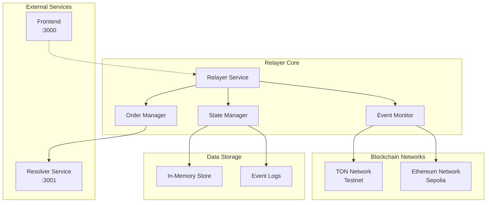
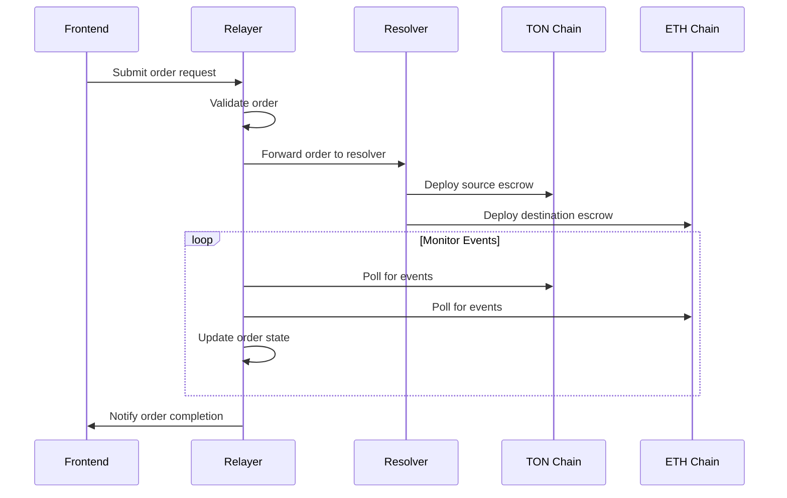

# Orbis Relayer Service

A lightweight Node.js service that facilitates cross-chain atomic swaps by coordinating between different blockchain networks. The relayer acts as an intermediary service that monitors blockchain events, manages order states, and triggers appropriate actions in the cross-chain swap process.

## 🌟 Features

- **Event Monitoring**: Real-time monitoring of blockchain events across multiple networks
- **Order Coordination**: Manages the lifecycle of cross-chain swap orders
- **State Management**: Tracks and updates order states throughout the swap process
- **Network Agnostic**: Supports multiple blockchain networks (TON, Ethereum, etc.)
- **Error Recovery**: Robust error handling and recovery mechanisms
- **Lightweight**: Minimal resource footprint for efficient operation

## 🏗️ Architecture



## 🚀 Quick Start

### Prerequisites

- Node.js 18+ and npm
- Access to blockchain RPC endpoints
- Basic understanding of cross-chain swaps

### Installation

1. **Clone and navigate**
   ```bash
   git clone <repository-url>
   cd orbis/relayer
   ```

2. **Install dependencies**
   ```bash
   npm install
   ```

3. **Configure environment**
   ```bash
   cp .env.example .env
   ```
   
   Edit `.env` with your configuration:
   ```env
   # Network Configuration
   TON_RPC_URL=https://testnet.toncenter.com/api/v2/jsonRPC
   TON_API_KEY=your_ton_api_key
   ETH_RPC_URL=https://sepolia.infura.io/v3/your_infura_key
   ETH_CHAIN_ID=11155111
   
   # Service Configuration
   RELAYER_PORT=3002
   RESOLVER_URL=http://localhost:3001
   
   # Monitoring Configuration
   POLL_INTERVAL=5000
   MAX_RETRIES=3
   TIMEOUT=30000
   ```

4. **Start the relayer**
   ```bash
   # Development mode
   npm run dev
   
   # Production mode
   npm start
   ```

## 📁 Project Structure

```
src/
├── relayer.ts          # Main relayer service implementation
├── end-to-end-ton.ts   # End-to-end TON integration
├── example.ts          # Usage examples and demos
├── types.ts            # TypeScript type definitions
└── utils/              # Utility functions (if any)
```

## 🔧 Configuration

### Environment Variables

| Variable | Description | Required | Default |
|----------|-------------|----------|---------|
| `TON_RPC_URL` | TON blockchain RPC endpoint | Yes | - |
| `TON_API_KEY` | TON Center API key | Yes | - |
| `ETH_RPC_URL` | Ethereum RPC endpoint | Yes | - |
| `ETH_CHAIN_ID` | Ethereum chain ID | No | 11155111 |
| `RELAYER_PORT` | Port for relayer service | No | 3002 |
| `RESOLVER_URL` | Resolver service URL | No | http://localhost:3001 |
| `POLL_INTERVAL` | Blockchain polling interval (ms) | No | 5000 |
| `MAX_RETRIES` | Maximum retry attempts | No | 3 |
| `TIMEOUT` | Request timeout (ms) | No | 30000 |

### Network Configuration

The relayer supports multiple blockchain networks:

```typescript
interface NetworkConfig {
  name: string;
  rpcUrl: string;
  chainId?: number;
  apiKey?: string;
  pollInterval: number;
}

const networks: NetworkConfig[] = [
  {
    name: 'TON_TESTNET',
    rpcUrl: process.env.TON_RPC_URL!,
    apiKey: process.env.TON_API_KEY,
    pollInterval: 5000
  },
  {
    name: 'ETHEREUM_SEPOLIA',
    rpcUrl: process.env.ETH_RPC_URL!,
    chainId: 11155111,
    pollInterval: 3000
  }
];
```

## 🔄 Relayer Flow

### Order Processing Flow



### Event Monitoring

The relayer continuously monitors blockchain events:

1. **Contract Deployments**: Tracks escrow contract deployments
2. **Fund Deposits**: Monitors when funds are deposited into escrows
3. **Secret Revelations**: Watches for secret revelation transactions
4. **Withdrawals**: Tracks successful withdrawals from escrows
5. **Timeouts**: Monitors for timeout conditions and refunds

## 📖 API Reference

### Core Relayer Class

```typescript
import { Relayer } from './relayer';

// Initialize relayer
const relayer = new Relayer({
  networks: [
    { name: 'TON_TESTNET', rpcUrl: 'https://testnet.toncenter.com/api/v2/jsonRPC' },
    { name: 'ETHEREUM_SEPOLIA', rpcUrl: 'https://sepolia.infura.io/v3/key' }
  ],
  resolverUrl: 'http://localhost:3001',
  pollInterval: 5000
});

// Start monitoring
await relayer.start();

// Process an order
await relayer.processOrder({
  orderId: 'order_123',
  sourceChain: 'TON_TESTNET',
  destinationChain: 'ETHEREUM_SEPOLIA',
  maker: 'EQD4FPq-PRDieyQKkizFTRtSDyucUIqrj0v_zXJmqaDp6_0t',
  taker: '0x742d35Cc6634C0532925a3b8D6Ac6d9C532a2b78',
  // ... other order details
});

// Stop relayer
await relayer.stop();
```

### Order Management

```typescript
// Get order status
const status = await relayer.getOrderStatus('order_123');

// Update order state
await relayer.updateOrderState('order_123', {
  status: 'DEPOSITED_SOURCE',
  phase: 'DEPOSITING',
  sourceEscrowAddress: 'EQC123...abc',
  updatedAt: Date.now()
});

// Get order history
const history = await relayer.getOrderHistory({
  maker: 'EQD4FPq-PRDieyQKkizFTRtSDyucUIqrj0v_zXJmqaDp6_0t',
  limit: 10
});
```

### Event Monitoring

```typescript
// Subscribe to blockchain events
relayer.on('contractDeployed', (event) => {
  console.log('Contract deployed:', event.address);
});

relayer.on('fundsDeposited', (event) => {
  console.log('Funds deposited:', event.amount);
});

relayer.on('secretRevealed', (event) => {
  console.log('Secret revealed for order:', event.orderId);
});

relayer.on('orderCompleted', (event) => {
  console.log('Order completed:', event.orderId);
});
```

## 🛠️ Development

### Available Scripts

```bash
# Development
npm run dev          # Start with nodemon (auto-reload)
npm start           # Start production server
npm run build       # Build TypeScript (if needed)

# Testing
npm test            # Run tests
npm run test:watch  # Run tests in watch mode

# Linting
npm run lint        # Run ESLint
npm run lint:fix    # Fix ESLint errors
```

### Example Usage

```typescript
// src/example.ts - Basic relayer usage
import { Relayer } from './relayer';

async function runExample() {
  const relayer = new Relayer({
    networks: [
      {
        name: 'TON_TESTNET',
        rpcUrl: 'https://testnet.toncenter.com/api/v2/jsonRPC',
        apiKey: process.env.TON_API_KEY,
        pollInterval: 5000
      }
    ],
    resolverUrl: 'http://localhost:3001'
  });

  // Start monitoring
  await relayer.start();
  console.log('Relayer started successfully');

  // Process a sample order
  const order = {
    orderId: `order_${Date.now()}`,
    sourceChain: 'TON_TESTNET',
    destinationChain: 'ETHEREUM_SEPOLIA',
    maker: 'EQD4FPq-PRDieyQKkizFTRtSDyucUIqrj0v_zXJmqaDp6_0t',
    taker: '0x742d35Cc6634C0532925a3b8D6Ac6d9C532a2b78',
    amount: '1000000000', // 1 TON
    secretHash: '0x1234567890abcdef...'
  };

  await relayer.processOrder(order);
  console.log('Order processed:', order.orderId);
}

runExample().catch(console.error);
```

### End-to-End Integration

```typescript
// src/end-to-end-ton.ts - Complete TON integration example
import { TonClient, Address } from '@ton/ton';
import { Relayer } from './relayer';

async function runEndToEndDemo() {
  // Initialize TON client
  const client = new TonClient({
    endpoint: 'https://testnet.toncenter.com/api/v2/jsonRPC',
    apiKey: process.env.TON_API_KEY
  });

  // Initialize relayer
  const relayer = new Relayer({
    networks: [{
      name: 'TON_TESTNET',
      rpcUrl: 'https://testnet.toncenter.com/api/v2/jsonRPC',
      apiKey: process.env.TON_API_KEY,
      pollInterval: 3000
    }],
    resolverUrl: 'http://localhost:3001'
  });

  // Start monitoring
  await relayer.start();

  // Monitor specific contract
  const escrowAddress = Address.parse('EQC123...abc');
  relayer.monitorContract(escrowAddress, {
    onDeployment: (tx) => console.log('Contract deployed:', tx.hash),
    onFunding: (tx) => console.log('Contract funded:', tx.hash),
    onWithdrawal: (tx) => console.log('Funds withdrawn:', tx.hash)
  });

  // Keep running
  process.on('SIGINT', async () => {
    await relayer.stop();
    process.exit(0);
  });
}

runEndToEndDemo().catch(console.error);
```

## 🔐 Security Considerations

### Event Validation

- **Signature Verification**: Validate all blockchain event signatures
- **Replay Protection**: Prevent processing of duplicate events
- **Chain Reorganization**: Handle blockchain reorganizations properly

### State Management

- **Atomic Updates**: Ensure order state updates are atomic
- **Consistency Checks**: Validate state transitions
- **Recovery Mechanisms**: Handle service restarts gracefully

### Network Security

- **RPC Security**: Use secure RPC endpoints with authentication
- **Rate Limiting**: Implement rate limiting for external API calls
- **Error Handling**: Proper error handling to prevent information leakage

## 🧪 Testing

### Unit Tests

```bash
# Run all tests
npm test

# Run specific test suite
npm test -- --grep "Relayer"

# Run with coverage
npm test -- --coverage
```

### Integration Tests

```bash
# Set test environment
export NODE_ENV=test
export TON_API_KEY=test_key
export ETH_RPC_URL=https://sepolia.infura.io/v3/test_key

# Run integration tests
npm run test:integration
```

### Manual Testing

1. **Start all services**
   ```bash
   # Terminal 1: Start resolver
   cd resolver && npm run dev
   
   # Terminal 2: Start relayer
   cd relayer && npm run dev
   
   # Terminal 3: Start frontend
   cd orbis-frontend && npm run dev
   ```

2. **Test order flow**
   ```bash
   # Create test order via frontend or API
   curl -X POST http://localhost:3000/api/orders \
     -H "Content-Type: application/json" \
     -d @test-order.json
   ```

3. **Monitor relayer logs**
   ```bash
   tail -f logs/relayer.log
   ```

## 📊 Monitoring and Metrics

### Health Monitoring

```typescript
// Health check endpoint
app.get('/health', (req, res) => {
  res.json({
    status: 'healthy',
    uptime: process.uptime(),
    activeOrders: relayer.getActiveOrdersCount(),
    lastEventTime: relayer.getLastEventTime(),
    networks: relayer.getNetworkStatus()
  });
});
```

### Performance Metrics

- **Order Processing Time**: Track time from order creation to completion
- **Event Processing Latency**: Monitor blockchain event processing delays
- **Error Rates**: Track error rates for different operations
- **Network Connectivity**: Monitor RPC endpoint availability

### Logging

```typescript
import winston from 'winston';

const logger = winston.createLogger({
  level: 'info',
  format: winston.format.combine(
    winston.format.timestamp(),
    winston.format.json()
  ),
  transports: [
    new winston.transports.File({ filename: 'logs/error.log', level: 'error' }),
    new winston.transports.File({ filename: 'logs/combined.log' }),
    new winston.transports.Console()
  ]
});

// Usage in relayer
logger.info('Order processed', { orderId, status });
logger.error('Failed to process event', { error: error.message });
```

## 🚀 Deployment

### Docker Deployment

```dockerfile
# Dockerfile
FROM node:18-alpine

WORKDIR /app
COPY package*.json ./
RUN npm ci --only=production

COPY src/ ./src/
COPY .env .env

EXPOSE 3002
CMD ["npm", "start"]
```

```bash
# Build and run
docker build -t orbis-relayer .
docker run -p 3002:3002 --env-file .env orbis-relayer
```

### Production Deployment

```bash
# Using PM2
pm2 start src/relayer.ts --name orbis-relayer --interpreter ts-node

# Using systemd
sudo systemctl start orbis-relayer
sudo systemctl enable orbis-relayer
```

### Environment-Specific Configuration

```typescript
// config/production.ts
export const productionConfig = {
  networks: [
    {
      name: 'TON_MAINNET',
      rpcUrl: 'https://toncenter.com/api/v2/jsonRPC',
      apiKey: process.env.TON_MAINNET_API_KEY,
      pollInterval: 3000
    },
    {
      name: 'ETHEREUM_MAINNET',
      rpcUrl: 'https://mainnet.infura.io/v3/your_key',
      chainId: 1,
      pollInterval: 2000
    }
  ],
  resolverUrl: 'https://resolver.orbis.bridge',
  maxRetries: 5,
  timeout: 60000
};
```

## 🔍 Troubleshooting

### Common Issues

1. **RPC Connection Issues**
   ```bash
   # Test TON RPC
   curl -X POST https://testnet.toncenter.com/api/v2/jsonRPC \
     -H "X-API-Key: your_key" \
     -d '{"jsonrpc":"2.0","method":"getAddressInformation","params":{"address":"EQD4FPq-PRDieyQKkizFTRtSDyucUIqrj0v_zXJmqaDp6_0t"},"id":1}'
   
   # Test ETH RPC
   curl -X POST https://sepolia.infura.io/v3/your_key \
     -H "Content-Type: application/json" \
     -d '{"jsonrpc":"2.0","method":"eth_blockNumber","params":[],"id":1}'
   ```

2. **Memory Leaks**
   ```bash
   # Monitor memory usage
   node --inspect src/relayer.ts
   
   # Use clinic.js for profiling
   clinic doctor -- node src/relayer.ts
   ```

3. **Event Processing Delays**
   - Reduce poll intervals for faster processing
   - Increase RPC endpoint limits
   - Implement event caching

### Debug Mode

```bash
# Enable debug logging
export DEBUG=relayer:*
npm run dev

# Verbose logging
export LOG_LEVEL=debug
npm run dev
```

## 📄 License

This project is licensed under the MIT License.

---

**⚠️ Production Note**: The relayer handles critical cross-chain operations. Ensure proper monitoring, error handling, and failover mechanisms in production environments. 