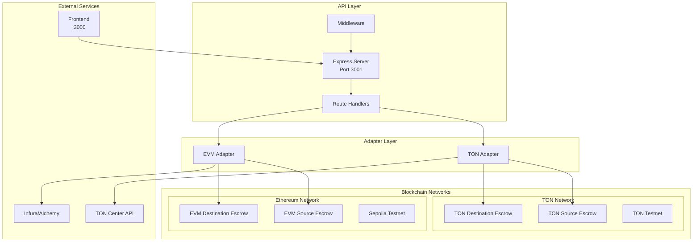
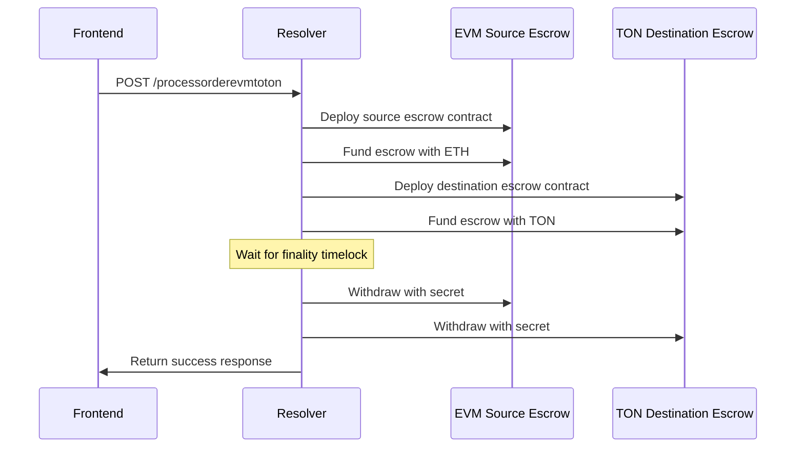

# Orbis Resolver Service

A high-performance Express.js API server that acts as the central resolver for cross-chain atomic swaps between TON and Ethereum networks. The resolver manages escrow contract deployment, secret handling, and swap execution across both blockchain networks.

## 🌟 Features

- **Bidirectional Swaps**: Support for both TON→ETH and ETH→TON atomic swaps
- **Dual Blockchain Support**: Native integration with TON and Ethereum networks
- **HTLC Management**: Hash Time Locked Contract deployment and interaction
- **Escrow Automation**: Automated escrow contract deployment and funding
- **Secret Management**: Secure secret generation, storage, and revelation
- **RESTful API**: Clean HTTP API for frontend integration
- **Real-time Monitoring**: Live transaction and contract state monitoring
- **Error Handling**: Comprehensive error handling and recovery mechanisms

## 🏗️ Architecture



## 🚀 Quick Start

### Prerequisites

- Node.js 18+ and npm
- TON wallet with testnet TON
- Ethereum wallet with Sepolia ETH
- API keys for TON Center and Ethereum RPC

### Installation

1. **Clone and navigate**
   ```bash
   git clone <repository-url>
   cd orbis/resolver
   ```

2. **Install dependencies**
   ```bash
   npm install
   ```

3. **Configure environment**
   ```bash
   cp env.example .env
   ```
   
   Edit `.env` with your configuration:
   ```env
   # TON Configuration
   TON_NETWORK=testnet
   TON_ENDPOINT=https://testnet.toncenter.com/api/v2/jsonRPC
   TON_API_KEY=your_ton_api_key
   TON_SOURCE_ESCROW_CODE=base64_encoded_contract_code
   TON_DESTINATION_ESCROW_CODE=base64_encoded_contract_code
   
   # EVM Configuration
   EVM_RPC_URL=https://sepolia.infura.io/v3/your_infura_key
   EVM_PRIVATE_KEY=your_ethereum_private_key
   EVM_ESCROW_FACTORY=0x_your_escrow_factory_address
   EVM_CHAIN_ID=11155111
   
   # Resolver Configuration
   DEFAULT_TIMELOCK_DURATION=3600
   DEFAULT_FINALITY_TIMELOCK=600
   DEFAULT_EXCLUSIVE_PERIOD=1800
   MIN_SAFETY_DEPOSIT=1000000000
   ```

4. **Start the server**
   ```bash
   # Development mode
   npm run dev
   
   # Production mode
   npm run build && npm start
   ```

5. **Verify server is running**
   ```bash
   curl http://localhost:3001/health
   ```

## 📁 Project Structure

```
src/
├── adapters/              # Blockchain adapter implementations
│   ├── TonAdapter.ts     # TON blockchain integration
│   ├── EvmAdapter.ts     # Ethereum blockchain integration
│   └── ResolverAdapter.ts # Base adapter interface
├── demo/                 # Demo and example scripts
│   ├── evm-end-to-end.ts # EVM swap demonstration
│   ├── same-chain-swap.ts # Same-chain swap example
│   └── simple-factory-demo.ts # Factory usage demo
├── config.ts            # Configuration management
├── server.ts            # Main Express server
├── types.ts             # TypeScript type definitions
└── typeston.ts          # TON-specific type definitions
```

## 🔧 Configuration

### Environment Variables

| Variable | Description | Required | Default |
|----------|-------------|----------|---------|
| `TON_NETWORK` | TON network (testnet/mainnet) | Yes | testnet |
| `TON_ENDPOINT` | TON RPC endpoint | Yes | - |
| `TON_API_KEY` | TON Center API key | Yes | - |
| `TON_MNEMONIC` | TON wallet mnemonic phrase | Yes | - |
| `TON_SOURCE_ESCROW_CODE` | Base64 encoded source escrow code | Yes | - |
| `TON_DESTINATION_ESCROW_CODE` | Base64 encoded destination escrow code | Yes | - |
| `EVM_RPC_URL` | Ethereum RPC URL | Yes | - |
| `EVM_PRIVATE_KEY` | Ethereum private key | Yes | - |
| `EVM_ESCROW_FACTORY` | Escrow factory contract address | Yes | - |
| `EVM_CHAIN_ID` | Ethereum chain ID | No | 11155111 |
| `DEFAULT_TIMELOCK_DURATION` | Default timelock duration (seconds) | No | 3600 |
| `DEFAULT_FINALITY_TIMELOCK` | Default finality timelock (seconds) | No | 600 |
| `DEFAULT_EXCLUSIVE_PERIOD` | Default exclusive period (seconds) | No | 1800 |
| `MIN_SAFETY_DEPOSIT` | Minimum safety deposit (nano-units) | No | 1000000000 |

### TON Configuration

#### Getting TON API Key
1. Visit [TON Center](https://toncenter.com/)
2. Create an account and generate API key
3. Add the key to your `.env` file

#### TON Wallet Setup
```bash
# Generate new mnemonic (if needed)
node -e "console.log(require('@ton/crypto').mnemonicNew())"

# Add mnemonic to .env file
TON_MNEMONIC="word1 word2 word3 ... word24"
```

### Ethereum Configuration

#### RPC Provider Setup
```bash
# Infura
EVM_RPC_URL=https://sepolia.infura.io/v3/YOUR_PROJECT_ID

# Alchemy
EVM_RPC_URL=https://eth-sepolia.g.alchemy.com/v2/YOUR_API_KEY

# Public RPC (not recommended for production)
EVM_RPC_URL=https://rpc.sepolia.org
```

## 📖 API Reference

### Health Check

```http
GET /health
```

**Response:**
```json
{
  "status": "healthy",
  "timestamp": "2024-01-15T10:30:00.000Z",
  "orders": 5
}
```

### TON to EVM Swap

```http
POST /processordertontoevm
POST /process-order
```

**Request Body:**
```json
{
  "maker": "EQD4FPq-PRDieyQKkizFTRtSDyucUIqrj0v_zXJmqaDp6_0t",
  "taker": "0x742d35Cc6634C0532925a3b8D6Ac6d9C532a2b78",
  "makerAsset": {
    "type": "NATIVE_TON",
    "address": "TON",
    "amount": "1000000000",
    "network": "TON_TESTNET"
  },
  "takerAsset": {
    "type": "NATIVE_ETH",
    "address": "ETH",
    "amount": "1000000000000000000",
    "network": "ETHEREUM_SEPOLIA"
  },
  "sourceChain": "TON_TESTNET",
  "destinationChain": "ETHEREUM_SEPOLIA",
  "refundAddress": "EQD4FPq-PRDieyQKkizFTRtSDyucUIqrj0v_zXJmqaDp6_0t",
  "targetAddress": "0x742d35Cc6634C0532925a3b8D6Ac6d9C532a2b78",
  "secretHash": "0x1234567890abcdef...",
  "timelockDuration": 3600,
  "finalityTimelock": 600,
  "exclusivePeriod": 1800,
  "makerSafetyDeposit": "100000000",
  "takerSafetyDeposit": "50000000000000000"
}
```

**Response:**
```json
{
  "success": true,
  "orderId": "order_1705312200000_abc123def",
  "order": {
    "orderId": "order_1705312200000_abc123def",
    "status": "DEPOSITED_SOURCE",
    "phase": "DEPOSITING",
    "maker": "EQD4FPq-PRDieyQKkizFTRtSDyucUIqrj0v_zXJmqaDp6_0t",
    "taker": "0x742d35Cc6634C0532925a3b8D6Ac6d9C532a2b78",
    "makerAsset": {
      "type": "NATIVE_TON",
      "address": "TON",
      "amount": "1000000000",
      "network": "TON_TESTNET"
    },
    "takerAsset": {
      "type": "NATIVE_ETH",
      "address": "ETH",
      "amount": "1000000000000000000",
      "network": "ETHEREUM_SEPOLIA"
    },
    "createdAt": 1705312200000,
    "updatedAt": 1705312200000
  },
  "contracts": {
    "sourceEscrow": "EQC123...abc",
    "destinationEscrow": "0x456...def"
  },
  "secret": {
    "hash": "0x1234567890abcdef..."
  }
}
```

### EVM to TON Swap

```http
POST /processorderevmtoton
```

**Request Body:** (Same as TON to EVM, but with reversed source/destination chains)

**Response:** (Same structure as TON to EVM response)

## 🔄 Swap Flow Details

### TON to EVM Flow


### EVM to TON Flow



## 🛠️ Development

### Available Scripts

```bash
# Development
npm run dev          # Start with nodemon (auto-reload)
npm run build        # Build TypeScript
npm start           # Start production server

# Testing
npm test            # Run tests
npm run test:watch  # Run tests in watch mode

# Linting
npm run lint        # Run ESLint
npm run lint:fix    # Fix ESLint errors

# Type checking
npm run typecheck   # TypeScript type checking
```

### Adding New Adapters

1. **Create adapter class**
   ```typescript
   // src/adapters/NewBlockchainAdapter.ts
   import { ResolverAdapter } from './ResolverAdapter';
   
   export class NewBlockchainAdapter implements ResolverAdapter {
     async deploySourceEscrow(order: FusionOrder): Promise<string> {
       // Implementation
     }
     
     async deployDestinationEscrow(order: FusionOrder): Promise<string> {
       // Implementation
     }
     
     // Other required methods...
   }
   ```

2. **Register in server**
   ```typescript
   // src/server.ts
   import { NewBlockchainAdapter } from './adapters/NewBlockchainAdapter';
   
   // In OrbisRelayerServer class
   private newAdapter?: NewBlockchainAdapter;
   
   // Initialize in constructor
   this.newAdapter = new NewBlockchainAdapter(config);
   ```

### Custom Demo Scripts

Create demo scripts in `src/demo/`:

```typescript
// src/demo/my-custom-demo.ts
import { loadConfig } from '../config';
import { TonAdapter } from '../adapters/TonAdapter';

async function runDemo() {
  const config = loadConfig();
  const adapter = new TonAdapter(config.ton);
  
  // Your demo logic here
}

runDemo().catch(console.error);
```

Run with:
```bash
npx ts-node src/demo/my-custom-demo.ts
```

## 🧪 Testing

### Unit Tests

```bash
# Run all tests
npm test

# Run specific test file
npm test -- --grep "TonAdapter"

# Run with coverage
npm test -- --coverage
```

### Integration Tests

```bash
# Set test environment variables
export TON_API_KEY=test_key
export EVM_RPC_URL=https://sepolia.infura.io/v3/test_key

# Run integration tests
npm run test:integration
```

### Manual Testing

1. **Start server in development mode**
   ```bash
   npm run dev
   ```

2. **Test health endpoint**
   ```bash
   curl http://localhost:3001/health
   ```

3. **Test swap creation**
   ```bash
   curl -X POST http://localhost:3001/processordertontoevm \
     -H "Content-Type: application/json" \
     -d @test-order.json
   ```

## 🔐 Security Considerations

### Private Key Management

- **Environment Variables**: Store private keys in environment variables only
- **File Permissions**: Ensure `.env` file has restricted permissions (600)
- **Production**: Use hardware security modules or key management services

### Network Security

- **HTTPS**: Always use HTTPS in production
- **CORS**: Configure CORS appropriately for your frontend domains
- **Rate Limiting**: Implement rate limiting for API endpoints

### Smart Contract Security

- **Timelock Validation**: Ensure proper timelock configurations
- **Secret Management**: Never log or expose secrets
- **Balance Checks**: Validate sufficient balances before operations

## 🚀 Deployment

### Docker Deployment

```dockerfile
# Dockerfile
FROM node:18-alpine

WORKDIR /app
COPY package*.json ./
RUN npm ci --only=production

COPY dist/ ./dist/
COPY .env .env

EXPOSE 3001
CMD ["npm", "start"]
```

```bash
# Build and run
docker build -t orbis-resolver .
docker run -p 3001:3001 --env-file .env orbis-resolver
```

### Production Deployment

1. **Build application**
   ```bash
   npm run build
   ```

2. **Set production environment variables**
   ```bash
   export NODE_ENV=production
   export TON_NETWORK=mainnet
   export EVM_CHAIN_ID=1
   # ... other production variables
   ```

3. **Start with process manager**
   ```bash
   # Using PM2
   pm2 start dist/server.js --name orbis-resolver
   
   # Using systemd
   sudo systemctl start orbis-resolver
   ```

## 🔍 Troubleshooting

### Common Issues

1. **TON Connection Issues**
   ```bash
   # Check TON API key
   curl "https://testnet.toncenter.com/api/v2/jsonRPC" \
     -H "X-API-Key: your_api_key"
   
   # Verify wallet mnemonic
   node -e "console.log(require('@ton/crypto').mnemonicValidate('your mnemonic'.split(' ')))"
   ```

2. **Ethereum Connection Issues**
   ```bash
   # Test RPC connection
   curl -X POST your_rpc_url \
     -H "Content-Type: application/json" \
     -d '{"jsonrpc":"2.0","method":"eth_blockNumber","params":[],"id":1}'
   ```

3. **Contract Deployment Failures**
   - Check gas prices and limits
   - Verify contract bytecode
   - Ensure sufficient balance for deployment

### Debug Mode

Enable debug logging:
```bash
export DEBUG=orbis:*
npm run dev
```

### Log Analysis

Check server logs for detailed error information:
```bash
# Development
tail -f logs/development.log

# Production
tail -f logs/production.log
```

## 📄 License

This project is licensed under the MIT License.

---

**⚠️ Production Warning**: This resolver handles real blockchain transactions. Ensure thorough testing and security auditing before mainnet deployment.
